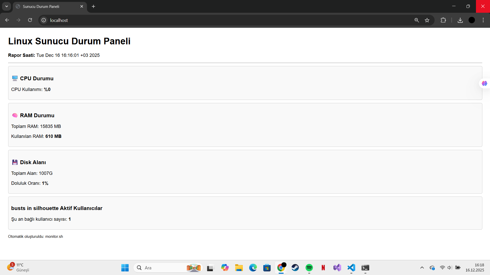

# Linux Sunucu Durum Paneli Projesi

## Proje Tanıtımı
Bu proje, Linux sunucusunun (veya WSL) anlık sağlık durumunu (CPU, RAM, Disk, Kullanıcılar) izleyen ve bunu HTML formatında web üzerinden yayınlayan bir Bash script otomasyonudur.

## Kurulum Adımları
1. **Web Sunucusu:** Apache2 sunucusu kuruldu (`sudo apt install apache2`).
2. **İzinler:** `/var/www/html` dizinine yazma izni verildi.
3. **Script:** `monitor.sh` dosyası oluşturuldu ve çalıştırılabilir yapıldı (`chmod +x`).

## Otomasyon (Cronjob)
Scriptin her dakika otomatik çalışması için Crontab ayarı yapıldı.
Kullanılan Cron komutu:
`* * * * * /home/kullaniciadi/monitor.sh`

## Ekran Görüntüsü

